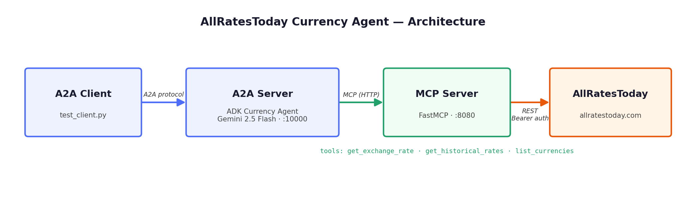

# 💵💱 AllRatesToday Currency Agent (A2A + ADK + MCP)

[](https://www.python.org/)
[](LICENSE)
[](https://allratestoday.com)

A currency conversion AI agent demonstrating **A2A + ADK + MCP** working together, powered by the [AllRatesToday](https://allratestoday.com) exchange rate API.

It uses the **Agent2Agent (A2A) Python SDK** ([`a2a-sdk`](https://github.com/a2aproject/a2a-python)), Google's **Agent Development Kit** ([`google-adk`](https://github.com/google/adk-python)), and a [FastMCP](https://github.com/jlowin/fastmcp) server that exposes live, historical, and reference exchange rate data from AllRatesToday.

## Overview



- **MCP Server** — exposes three tools backed by [allratestoday.com](https://allratestoday.com):
  | Tool | Description |
  |---|---|
  | `get_exchange_rate` | Live exchange rate between two currencies (e.g. USD → EUR) |
  | `get_historical_rates` | Historical rates over a period (`1d`, `7d`, `30d`, `1y`) |
  | `list_currencies` | 150+ supported ISO 4217 currencies with names and symbols |
- **ADK Agent** — orchestrates the conversation and invokes the MCP tools when needed.
- **A2A Server/Client** — advertises the agent over the Agent2Agent protocol so other agents can call it.

## Getting Started

### Prerequisites

- Python 3.10+
- A **free AllRatesToday API key** — sign up at [allratestoday.com/register](https://allratestoday.com/register) (no card required)
- A Google AI Studio API key (for the Gemini model used by the ADK agent)

### Installation

1. Clone the repository:

```bash
git clone https://github.com/AllRates-Today/currency-agent.git
cd currency-agent
```

2. Install [uv](https://docs.astral.sh/uv/getting-started/installation) (used to manage dependencies):

```bash
curl -LsSf https://astral.sh/uv/install.sh | sh
```

3. Configure environment variables:

```bash
cp .env.example .env
# then edit .env and set ALLRATES_API_KEY and GOOGLE_API_KEY
```

### Run it (three terminals)

**Terminal 1 — MCP server:**

```bash
export $(grep -v '^#' .env | xargs)  # or rely on your shell env
uv run mcp-server/server.py
```

**Terminal 2 — A2A server (ADK agent):**

```bash
uv run uvicorn currency_agent.agent:a2a_app --host localhost --port 10000
```

**Terminal 3 — A2A client:**

```bash
uv run currency_agent/test_client.py
```

You should see the agent answer questions like *"how much is 100 USD in CAD?"* using live AllRatesToday rates.

### Test the MCP server directly

```bash
uv run mcp-server/test_server.py
```

## Use the MCP server with Claude Desktop / Cursor instead

If you just want exchange rate tools in your MCP client (without ADK/A2A), use the production [allratestoday-mcp](https://github.com/AllRates-Today/mcp-server) server:

```json
{
  "mcpServers": {
    "allratestoday": {
      "command": "npx",
      "args": ["-y", "@allratestoday/mcp-server"],
      "env": { "ALLRATES_API_KEY": "art_live_..." }
    }
  }
}
```

## About AllRatesToday

[AllRatesToday](https://allratestoday.com) is a fast, developer-friendly exchange rate API with live and historical rates for 150+ currencies, a generous free tier, and SDKs/integrations including an [MCP server](https://github.com/AllRates-Today/mcp-server).

## Acknowledgements

Based on the excellent [jackwotherspoon/currency-agent](https://github.com/jackwotherspoon/currency-agent) sample (Apache 2.0), adapted to use the AllRatesToday API.

## License

[MIT](LICENSE)
